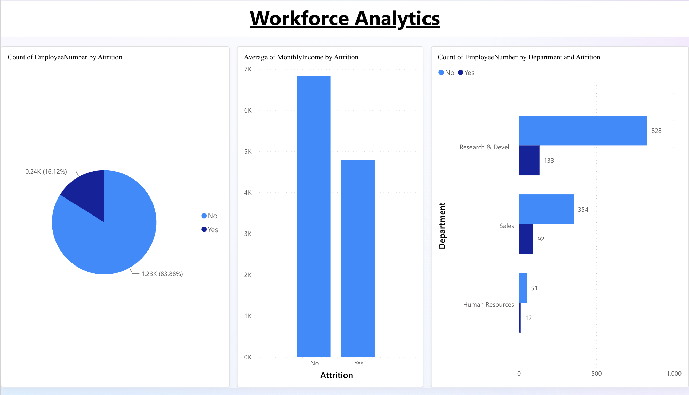
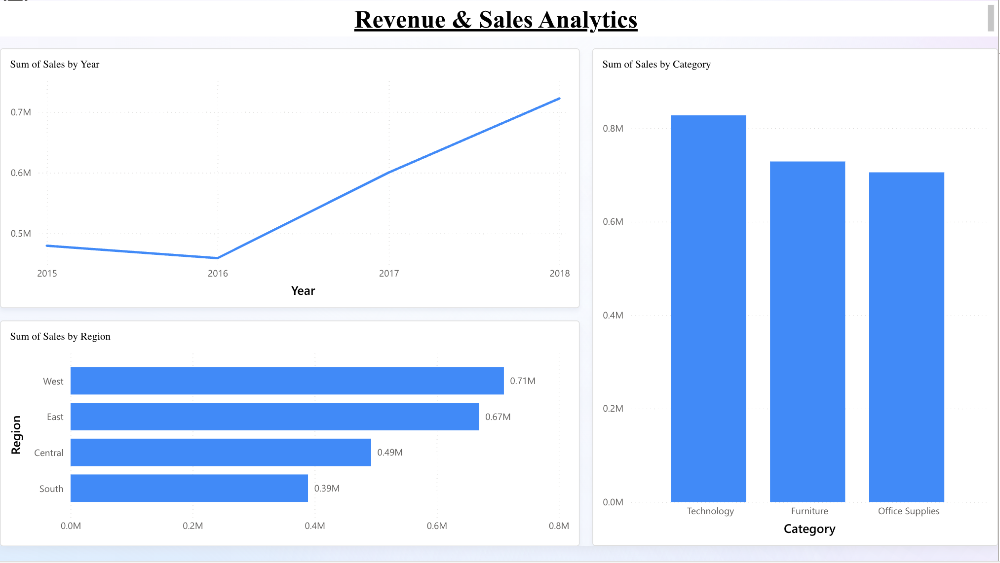
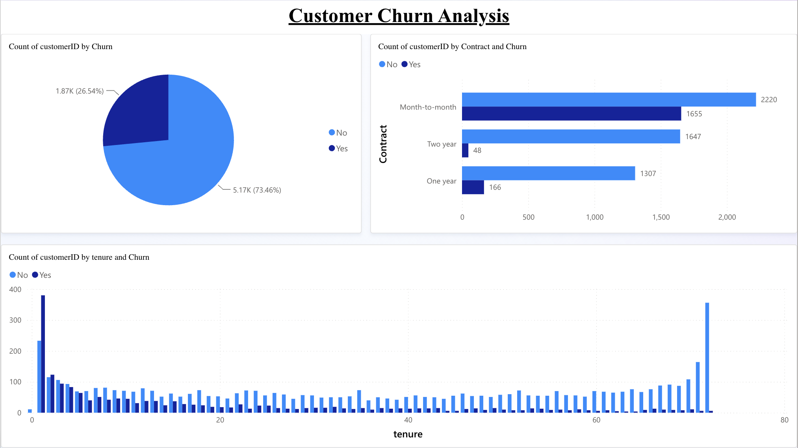
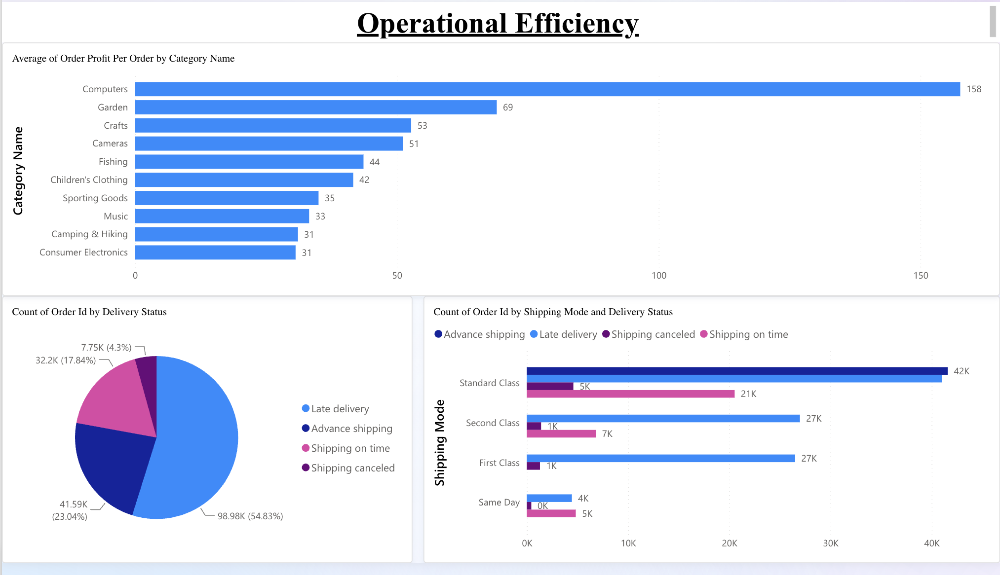
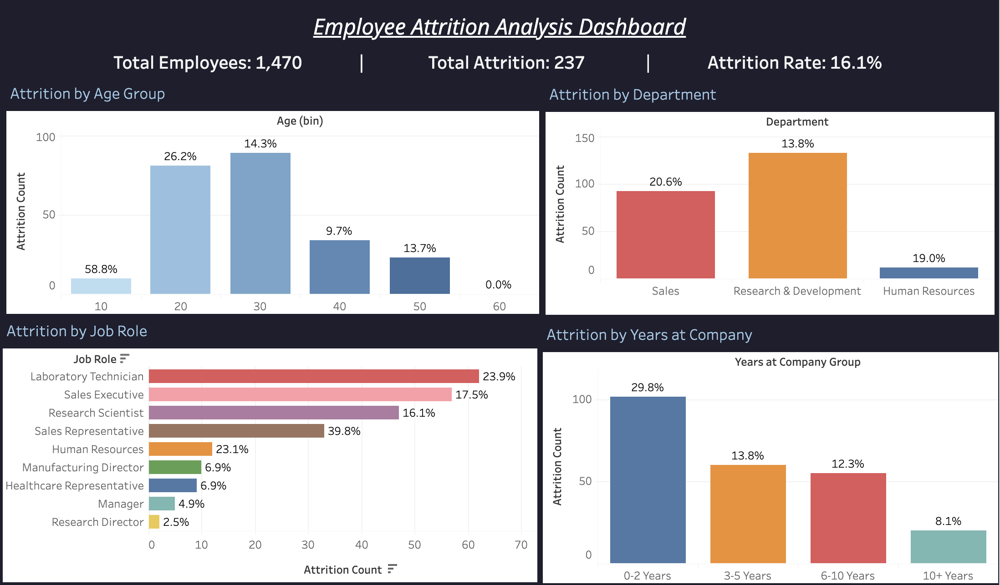

# 360° Business Intelligence: SaaS Company Health Analysis

> **A complete end-to-end Business Intelligence project** analyzing a fictional SaaS company across 5 analytical pillars using SQL, Python, Power BI, and Tableau.

---

## The Business Problem

A mid-sized SaaS company is facing simultaneous crises across every department. Leadership hired a Business Analyst to diagnose what's broken, find the connections between problems, and deliver data-backed recommendations.

| Crisis | Metric | Impact |
|---|---|---|
| Talent Hemorrhage | 16.1% annual attrition | Sales losing 1 in 5 employees per year |
| Customer Churn | 26.5% churn rate | $139,000 lost in monthly recurring revenue |
| Operations Failure | 54.8% late delivery rate | First Class shipping is 95% late |
| No Visibility | Data in silos | No unified view of company health |

---

## Project Architecture

| Pillar | Business Question | Dataset | Tools |
|---|---|---|---|
| Workforce Analytics | Why are our best employees leaving? | IBM HR Attrition | SQL · Python · Power BI · Tableau |
| Revenue & Sales | Where is growth happening and where isn't it? | Superstore Sales | SQL · Power BI |
| Customer Churn | Who is about to cancel and why? | Telco Customer Churn | SQL · Python ML · Power BI |
| Product Analytics | Which products and categories drive value? | Olist E-Commerce | Python EDA · Power BI |
| Operational Efficiency | Where are our biggest process failures? | DataCo Supply Chain | SQL · Power BI |

---

## Key Findings

| Metric | Value | Insight |
|---|---|---|
| Employee Attrition Rate | **16.1%** | Sales dept at 20.6% - nearly double the average |
| Overtime Quit Risk | **3x** | Overtime workers leave at 3x the rate of others |
| Monthly Salary Gap | **$2,000** | Leavers earn $2K/month less than employees who stay |
| Customer Churn Rate | **26.5%** | Month-to-month contracts churning at 42.7% |
| Revenue Lost Per Month | **$139K** | Directly attributable to churned customers |
| Late Delivery Rate | **54.8%** | First Class shipping has a 95% late rate |
| ML Model Accuracy | **~80%** | Logistic Regression churn prediction model |
| ML Attrition Model | **82.9%** | Decision Tree attrition prediction model |

---

## Dashboards

### Power BI - Workforce Analytics


### Power BI - Revenue & Sales


### Power BI - Customer Churn


### Power BI - Operational Efficiency


### Tableau - Employee Attrition Dashboard


> **Live interactive Tableau dashboard:** [public.tableau.com/app/profile/shailanshi.gupta/viz/360BIAttritionAnalysis](https://public.tableau.com/app/profile/shailanshi.gupta/viz/360BIAttritionAnalysis)

---

## Strategic Recommendations

**01 - HR - IMMEDIATE**
Conduct a targeted salary review for the Sales department and introduce an overtime reduction policy. The $2K/month income gap is the single most actionable lever identified. Projected outcome: reduce Sales attrition from 20.6% to below 12% within 12 months, saving over $50,000 per year in replacement costs per retained employee.

**02 - CX - HIGH IMPACT**
Launch an annual contract conversion campaign targeting month-to-month customers identified as high-risk by the ML churn model. Offering a 10% discount for annual upgrades could recover $80,000-$100,000 in monthly recurring revenue.

**03 - OPS - URGENT**
Initiate an immediate root cause audit of First Class shipping. A 95% late rate on the most expensive tier is a routing or vendor failure, not a capacity issue. Suspend upselling of First Class until resolved.

**04 - SALES - GROWTH**
Reallocate 20% of Furniture marketing budget to Technology category and West region campaigns. Technology delivers the highest profit margin. Projected outcome: 12-15% improvement in overall profitability.

---

## Repository Structure

```
360-BI-SaaS-Analysis/
├── sql/
│   ├── workforce_analysis.sql
│   ├── revenue_analysis.sql
│   ├── churn_analysis.sql
│   └── operations_analysis.sql
├── python/
│   ├── Day5_Data_Cleaning_EDA.py
│   └── Day6_ML_Models.py
├── powerbi/
│   ├── Workforce_Analytics.pbix
│   ├── Revenue_Sales.pbix
│   ├── Customer_Churn.pbix
│   ├── Operational_Efficiency.pbix
│   └── Executive_Summary.pbix
├── tableau/
│   └── 360_BI_Attrition_Analysis.twbx
├── presentations/
│   └── 360_BI_SaaS_Analysis.pptx
├── docs/
│   └── 360_BI_Executive_Summary.docx
└── images/
    ├── workforce_analytics.png
    ├── revenue_sales.png
    ├── customer_churn.png
    ├── operational_efficiency.png
    └── tableau_dashboard.png
```

---

## Tools & Technologies

| Tool | Version | Purpose |
|---|---|---|
| SQL (SQLite / DB Browser) | - | Data extraction, KPI queries, trend analysis |
| Python (Spyder / Jupyter) | 3.x | Data cleaning, EDA, machine learning |
| pandas, matplotlib, seaborn | - | Data manipulation and visualization |
| scikit-learn | - | Logistic Regression, Decision Tree models |
| Power BI (Web) | - | Interactive dashboards, DAX measures |
| Tableau Public | - | Interactive attrition dashboard |

---

## Datasets

| Dataset | Source | Records |
|---|---|---|
| IBM HR Analytics Employee Attrition | Kaggle | 1,470 employees |
| Superstore Sales | Kaggle | 9,994 orders |
| Telco Customer Churn | Kaggle | 7,043 customers |
| Olist E-Commerce | Kaggle | 180,519 orders |
| DataCo Supply Chain | Kaggle | 180,519 records |

---

## About

**Shailanshi Gupta**
MS Business Analytics - Northeastern University (December 2026)

[LinkedIn](https://linkedin.com/in/shailanshi-gupta) · 
[Tableau Public](https://public.tableau.com/app/profile/shailanshi.gupta)
